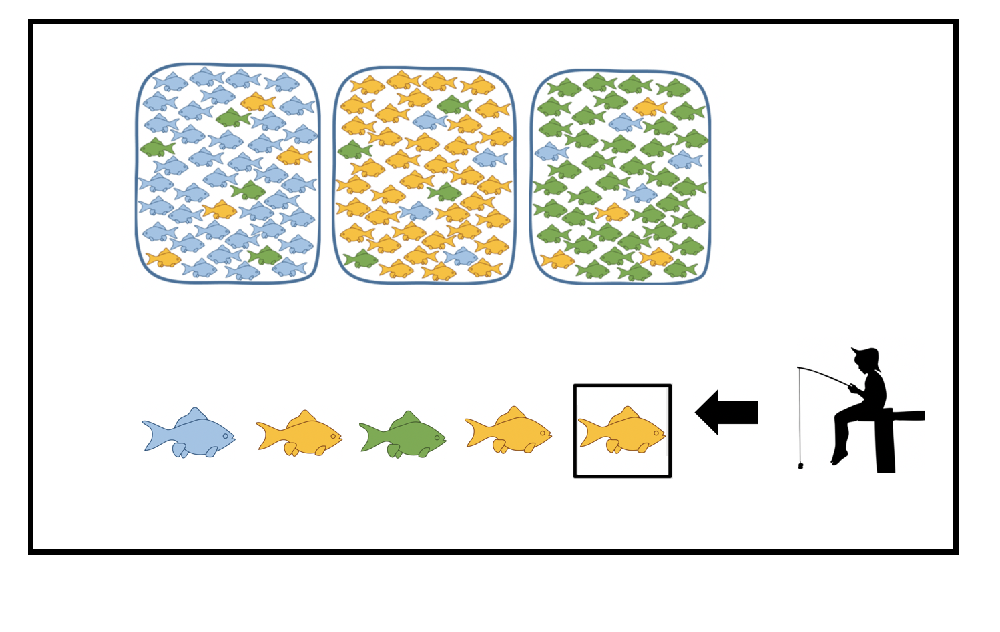

# Computational Modeling of Decision-Making Behavior

Computational model-based analysis of human behavior in the **Fish Tank** probabilistic reversal learning task. Models are applied to characterize differences in learning and decision-making between individuals with **Binge Eating Disorder (BED)** and **Healthy Controls (HC)**.

---

## Repository Structure

```
├── fish_task/
│   ├── figures/
│   │   └── task_schematic.png  # Task diagram
│   ├── notebooks/          # Analysis notebooks (run in order)
│   │   ├── 01_data_exploration.ipynb
│   │   ├── 02_heuristic_model.ipynb
│   │   ├── 03_rescorla_wagner_model.ipynb
│   │   ├── 04_bayesian_model.ipynb
│   │   ├── 05_bayesian_gradient_descent.ipynb
│   │   ├── 06_rescorla_wagner_gradient_descent.ipynb
│   │   ├── 07_heuristic_gradient_descent.ipynb
│   │   └── 08_dynamic_bayesian_model.ipynb
│   └── src/
│       └── models.py       # Shared environment, agent, and utility functions
├── requirements.txt
└── .gitignore
```

---

## Fish Tank Task

### Task Description



Subjects observe a sequence of colored fish (Blue, Orange, or Green) drawn from one of three tanks, each with a distinct color distribution:

| Tank | Blue | Orange | Green |
|------|------|--------|-------|
| 1    | 0.80 | 0.10   | 0.10  |
| 2    | 0.10 | 0.80   | 0.10  |
| 3    | 0.10 | 0.10   | 0.80  |

On each trial, subjects must predict which tank the fish was drawn from. Within a block of 15 trials, the source tank may reverse once or twice at an unpredictable point. Subjects are tested across 10 blocks, requiring continuous belief updating in response to reversals.

**Clinical groups:**
- **BED** — Binge Eating Disorder patients
- **HC** — Healthy Controls

> **Reference:** The Fish Tank task and experimental design are described in:
> *NeuroImage* (2021). [https://doi.org/10.1016/j.neuroimage.2021.118742](https://www.sciencedirect.com/science/article/pii/S1053811921010922)

### Cognitive Models

Three computational models are implemented and compared. All models are fit by minimizing negative log-likelihood via grid search over a parameter grid.

#### 1. Heuristic Model (`02_heuristic_model.ipynb`)
A simple probability tracking rule: after observing a fish of color *c*, the probability assigned to *c* is incremented by a fixed amount *p* and the vector is renormalized.

- **Free parameter:** `p` ∈ (0, 1) — update step size
- **Fitting:** 1D grid search over *p*

#### 2. Rescorla-Wagner Reinforcement Learning (`03_rescorla_wagner_model.ipynb`)
A reward-based learning model. The agent maintains value estimates for each tank choice, updated trial-by-trial using the prediction error:

```
V(t+1) = V(t) + α · (reward - V(t))
```

Choice probabilities are derived via a softmax function with temperature τ.

- **Free parameters:** `α` ∈ (0, 1) (learning rate), `τ` > 0 (softmax temperature)
- **Fitting:** 2D grid search over (α, τ)

#### 3. Bayesian Learning (`04_bayesian_model.ipynb`, `05_bayesian_gradient_descent.ipynb`)
A normative Bayesian observer that updates posterior beliefs over tank identity using a likelihood matrix parameterized by λ. Higher λ means stronger concentration of the likelihood around the "correct" fish color.

```
P(tank | fish_color) ∝ P(fish_color | tank; λ) · P(tank)
```

The likelihood matrix:
```
L[color, tank] = λ · I + (1-λ)/2 · (1 - I)
```
where I is the identity matrix (color matches dominant tank color).

- **Free parameter:** `λ` ∈ (0, 1) — likelihood concentration
- **Fitting:** Grid search (notebook 04) and gradient descent (notebook 05)

- #### 4. Dynamic Bayesian Learning (`08_dynamic_bayesian_model.ipynb`)
An extension of the Bayesian Learning model where λ is not a fixed parameter but varies dynamically as a function of the agent's current prior belief, shaped by the regularized incomplete Beta function:

```
λ(prior) = th1 - betainc(α, β, prior) × th2
```

This allows the effective likelihood concentration to increase or decrease with confidence — e.g., becoming more decisive as belief strengthens (decreasing λ curve) or more exploratory (increasing λ curve). Four grid configurations are explored covering both directions and α/β dominance, with the best-fitting configuration selected per subject.

- **Free parameters:** `α`, `β` (Beta shape), `th1` (start value of λ), `th2` (range/direction)
- **Fitting:** 4-configuration grid search over (α, β) × (th1, th2)


### Analysis Pipeline

Each model notebook follows the same structure:

1. **Data loading** — `.mat` files for BED and HC subjects, parsed into a tidy `pandas` DataFrame with columns: `SubjectID`, `BlockID`, `TrialID`, `PredLabels`, `TrueLabels`, `ObservedLabel`, `Reward`, `Morbidity`
2. **Parameter fitting** — grid search over the free parameter space, minimizing summed negative log-likelihood per subject
3. **Parameter distribution** — KDE of best-fit parameters across subjects, violin plots comparing BED vs HC
4. **Parameter recovery** — KDE-resample best-fit parameters → simulate synthetic dataset → re-fit → scatter recovered vs. true parameters to assess identifiability
5. **Model comparison** (`01_data_exploration.ipynb`) — BIC-based model comparison across all three model families

### Shared Code

`fish_task/src/models.py` contains the core classes and gradient functions shared across all notebooks:

- **`fish_tank`** — environment simulator (draws fish, tracks history, manages block structure)
- **`agent`** — cognitive agent implementing all three model policies via a unified interface
- **`dynamic_lambda(prior, alpha, beta, th1, th2)`** — dynamic λ(prior) via incomplete Beta function (BL_beta model)
- **`gradient_alpha(tau, val, prev_val, rwrd, pred)`** — analytical gradient of log-likelihood w.r.t. α (RW model)
- **`gradient_tau(tau, val, prev_val, rwrd, pred)`** — analytical gradient of log-likelihood w.r.t. τ (RW model)
- **`gradient_prob(p, prob, pred, observ)`** — analytical gradient of log-likelihood w.r.t. p (Heuristic model)

---

## Setup

```bash
pip install -r requirements.txt
jupyter notebook
```

> **Data availability:** Raw behavioral data (`.mat` files) are not included in this repository due to IRB restrictions. The notebooks contain data loading cells that reference local paths; replace with your own data path to reproduce analyses. Simulated datasets used for parameter recovery are generated within the notebooks and require no external data.

---

## Methods Summary

| Model | Free Parameters | Fitting Method | Data | Notebook |
|-------|----------------|----------------|------|----------|
| Heuristic | p (1 param) | Grid search | Real (BED/HC) | 02 |
| Rescorla-Wagner RL | α, τ (2 params) | Grid search | Real (BED/HC) | 03 |
| Bayesian Learning | λ (1 param) | Grid search | Real (BED/HC) | 04 |
| Bayesian Learning | λ (1 param) | Gradient descent | Simulated | 05 |
| Rescorla-Wagner RL | α, τ (2 params) | Gradient descent | Simulated | 06 |
| Heuristic | p (1 param) | Gradient descent | Simulated | 07 |
| Dynamic Bayesian (BL_beta) | α, β, th1, th2 (4 params) | Grid search ×4 configs | Real (BED/HC) | 08 |
| Model comparison | — | BIC | Real (BED/HC) | 01 |
